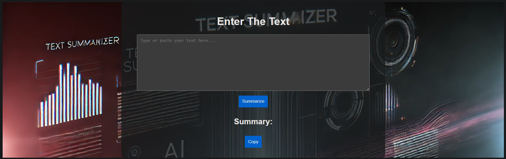
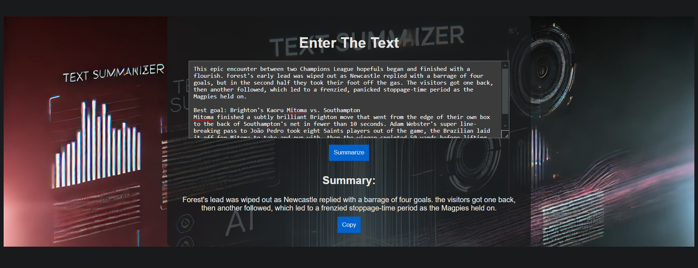

# Text Summarizer

## Overview
This project is a **Text Summarizer** that takes user input text and generates a concise summary using a trained model. It is built using Python, Flask, and a deep learning model.

## Project Structure
```
text-summarizer/
├── app.py                 # Flask application
├── requirements.txt       # Required dependencies
├── Text_Summarizer_full.ipynb  # Jupyter Notebook for model training
├── models/
│   ├── text_summarizer_full.pth  # Trained model
├── templates/
│   ├── index.html         # Frontend HTML file
├── static/
│   ├── css/
│   │   ├── style.css      # Styling file
│   ├── js/
│   │   ├── script.js      # JavaScript functionality
├── screenshots/           # Folder for images showing the summarization process
```

## Installation & Execution

### 1. Clone the Repository
```bash
git clone https://github.com/yourusername/text-summarizer.git
cd text-summarizer
```

### 2. Install Dependencies
```bash
pip install -r requirements.txt
```

### 3. Run the Flask App
```bash
python app.py
```

The application will be available at `http://127.0.0.1:5000/`.

## Usage
1. Open the web application in your browser.
2. Enter a text passage in the input box.
3. Click on the "Summarize" button.
4. The summarized text will be displayed below.

## Screenshots
| Before Summarization | After Summarization |
|------------------|----------------|
|  |  |

Replace `screenshots/before.png` and `screenshots/after.png` with the actual paths of your images in the repository.

## Model Details
The summarization model is a deep learning-based approach trained on a large dataset. The model file is stored in the `models/` directory as `text_summarizer_full.pth`.

## Technologies Used
- **Flask** - Backend framework
- **PyTorch** - Deep Learning framework
- **HTML, CSS, JavaScript** - Frontend
- **Jupyter Notebook** - Model training

## Contributing
Feel free to contribute by opening issues or submitting pull requests.

## License
This project is licensed under the MIT License.


